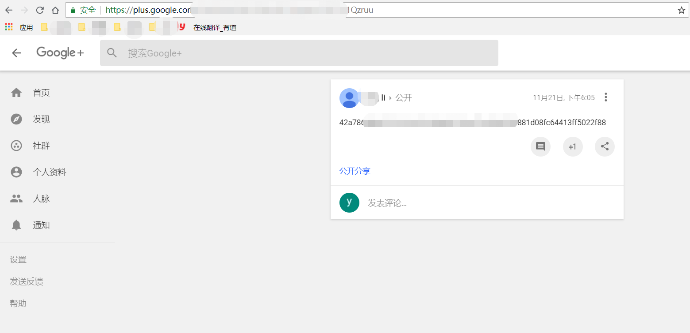

# 以太坊测试网络Rinkeby使用教程

##### 一、Rinkeby

1. 以太坊的测试网络：

- Morden（已退役）2015.7-2016.11     难度炸弹严重影响出块速度
  共识机制：POW，networkid为2.
- Ropsten（仍运行）                  为解决难度炸弹严重影响出块速度问题
  共识机制：POW，networkid为3.
- Kovan（仍运行）                    仅有Parity钱包客户端可以使用这个测试网络。
  共识机制：权威证明（PoA），networkid为3.
- Rinkeby（仍运行)
  共识机制：POA，networkid为4.

2. Rinkeby 是开发人员目前常用的测试网络，使用PoA共识机制，[访问地址](https://www.rinkeby.io/)

- 权威证明PoA（Proof of Authority）：简单来说就是权威的人士（大家事先公认的）用他们的声誉去验证交易和区块，通过把身份和声誉绑定在一起，见证人被激励去验证交易和维护网络安全。由若干个验证人（validator）来生成区块记录交易，并获得区块奖励和交易费用。验证者的身份信息均公布在POA Network主页上，并且都必须是美国公证人。在PoA中，验证者（validator）是整个共识机制的关键。验证者不需要昂贵的显卡，也不需要足够的资产，但他必须具有已知的，并且已获得验证的身份。验证者通过放置这个身份来获得担保网络的权利，从而换取区块奖励。若是验证者在整个过程中有恶意行为，或与其他验证者勾结。那通过链上管理可以移除和替换恶意行为者。现有的法律反欺诈保障会被用于整个网络的参与者免受验证者的恶意行为。

- POA项目具有以下独特特点
  - 有效缓解以太坊拥堵的问题。据称每5秒生成区块，每天能处理150万笔交易。
  - 不需要挖矿，绿色环保。
  - 分叉受法律约束，每个Validator均签订法律协议。换句话说，每个Validator对自己验证的交易行为负有一定法律责任。
  - 于出块速度快，交易容量高，POA Network上的交易不需要支付高昂贵的gas，更有利于基于其开发的DAPP的推广运用，更有利于构建良好的生态系统

- POA Network兼容以太坊上所有DAPP，任何基于以太坊开发的应用均可轻松移植到POA Network。如果PoA共识机制能够运行平稳，预计会有越来越多的创业者会选择使用POA Network开发DAPP。

- 本文从以下几方面介绍Rinkeby 的基本使用方法：

  - 创建 Rinkeby 账户

  - 获取Rinkeby 的以太币
  - 交易
  - 智能合约部署
  - 智能合约交互

##### 二、创建Rinkeby 账户

1. Geth客户端

- 首先，需要在Rinkeby网络中创建账户，也就是生成钱包地址。使用Geth客户端，键入 `geth --rinkeby console`可以直接进入Rinkeby网络, 但Geth客户端不太方便进行操作，可以使用钱包客户端代替。
- [下载Ethereum Wallet 和 Mist](https://github.com/ethereum/mist/releases)
- 安装的时候注意把网络切换为Rinkeby。
- 缺点：这两个客户端进行区块同步需要花大量时间、占用存储空间

2. 在线钱包MyEtherWallet

- [MyEtherWallet链接](https://www.myetherwallet.com/)

- 创建 Rinkeby 账户

  (1)进入MyEtherWallet网站，在右上方选择Rinkeby网络，输入密码创建一个钱包地址（注意：将右上角的网络改为Rinkeby）

  

  （2）下载keystone文件，在本地妥善保存

   keystore 文件是用于签署交易的以太坊私钥的加密文件。如果丢失了这个文件，就等于丢失了私钥，意味着失去了签署交易的能力，资金将被永久的锁定在了你的账户里。

  

  (3)下载完成后，点击I understand. Continue。 保存好私钥，记录下地址，如果需要可以打印，这里可直接显示地址和私钥。

  

  此时Rinkeby 账号账号已创建好。

##### 三、获取Rinkeby 的以太币

但这个账号里还没有币，想获取Rinkeby测试网络中的以太币，需要去申请，这个申请Rinkeby以太币的功能被称为水龙头(Faucet)。[Rinkeby Authenticated Faucet网址](https://faucet.rinkeby.io/)

为避免无限申请Rinkeby以太币,水龙头需要借助第三方账号来确定申请者的身份和配额。获取方法是在Twitter、FaceBook、Google+任意一个社交网络上发布一条带有钱包地址的消息，并将消息的网址粘贴到上面截图的输入框中选个获取就可以。

-  注册Google账号

  Google注册时，电话号码无法用于验证。此时，不要用chrome注册，可以换成别的浏览器打开网址[注册Google网址](http://accounts.google.com/)进行注册，问题就解决了

- 打开Google+,登录账号 [Google+](https://plus.google.com/)，把之前创建的钱包地址作为内容发送一条消息。

- 点击转发按钮，会跳转到一个页面

  

- 3、将该页面的地址复制到Rinkeby以太币申请框里，选择冷却时间。

- 显示请求已接受就说明获取成功了。可以到[区块浏览器](https://rinkeby.etherscan.io/)输入钱包地址查看。

现在我们的账户里有3个币,可以进行交易测试。

##### 四、交易

1.回到MyEtherWallet网站，点击Send Ether &Tokens 进行交易。使用Keystore / JSON File 方法访问账户。

上传wallet 文件 也就是之前保存的keystore文件，输入密码unlock。

2.进入交易页面，填好转账的地址（转给谁），转账金额，gas limit可以设置大一点，小了可能会提示错误。点击创建交易、确认交易即可。

  

3、到[区块链浏览器](https://rinkeby.etherscan.io/)上去查询一下这笔交易，输入钱包地址，点击查询。

交易完成！

##### 五、智能合约部署

1、回到MyEtherWallet网站，点击Contract 进行智能合约交互与部署。点击Deploy Contract，进入合约部署页面。将智能合约二进制码拷贝进去，设置Gas Limit，解锁自己的账户，签署该交易，确认发布。

2、到[区块链浏览器](https://rinkeby.etherscan.io/)上查询这笔交易，可看到部署成功，并得到合约地址(箭头所指)：

智能合约部署成功！

##### 六、智能合约交互

1、回到MyEtherWallet网站，点击Contract 进行智能合约交互与部署。将合约地址，以及ABI填入，点击Access, 选择访问函数接口，这个智能合约只有multiply一个函数，因此选择它，然后输入参数的值，并解锁自己的账户。

这里填好金额和 gas, 确认交易发送交易即可

2、到区块链浏览器通过输入钱包地址或者合约地址查看该交易。input里的数据是调用的函数及参数，该函数已经执行，函数只是一个返回值，如果函数是类似交易转账的功能，则对应的转账会被自动完成。

参考文章：https://zhuanlan.zhihu.com/p/29010231