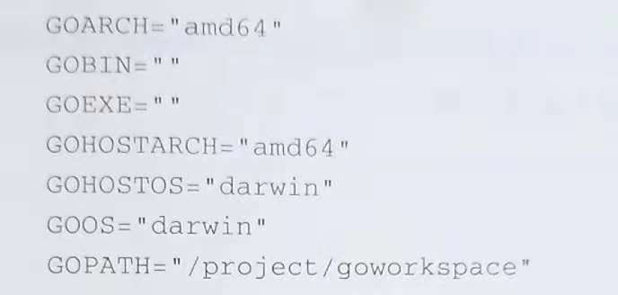
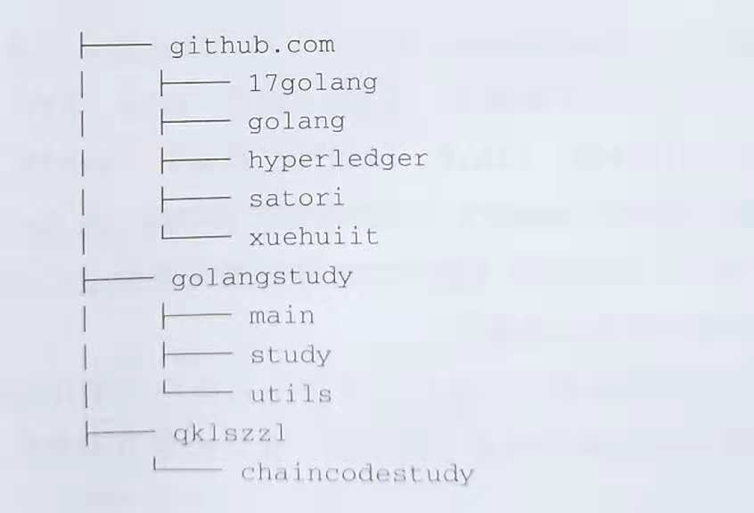

# 第2章 实战准备
##### 2.1 开发环境准备
###### 1. Docker的使用
（1）Docker的安装和配置
① Ubuntu上面安装Docker
执行下面的命令安装Docker和Docker Compose
```
apt install docker.io
apt install docker-compose
```
② Centos上面安装Docker
Centos有的版本采用service命令启动，有的采用systemctl命令。
执行下面的命令：
```
yum install docker python-pip
pip install --upgrade pip
pip install docker-compose
```
安装完成之后需要执行下面的命令启动docker
​	`service docker start`
docker安装完成之后执行以下命令检查是否打开http通道，否则后面会出现无法识别的错误。
###### 2. Docker的常用命令
(1)查看Docker版本
      `docker version**`
(2)查看镜像的列表
     `docker images`
(3)查看当前运行的镜像
    `docker ps`
(4)查看容器的详细信息
    `docker inspect 142aef786231`
`docker inspect`后面的参数是`docker ps`命令返回结果中的`CONTAINER ID`字段的值，这是一个非常重要的命令。
(5)运行镜像
	`docker start -it -p 8880:80 nginx`
`docker start`(start后面的参数为容器编号或者容器名称，在执行完`docker create`命令之后，可以通过`docker ps -a`命令获取)
(6)创建容器并且运行容器
	`docker run -d -p 8880:80 nginx`
- `-d`:守护进程运行
- `-p`:端口映射，后面的是Docker容器内的端口，前面的是宿主服务器的端口。
- `nginx`：是镜像的名字
(7)查询本镜像
    `docker images`
(8)停止正在运行的镜像实例
    `docker stop 0067a3c9ef6c`
(9)进入容器
    `docker exec -it c4dbfde3b039 /bin/bash`
(10)导出Docker镜像
    `sudo docker save -o 导出的文件路径 镜像名称：版本号`
(11)导入Docker镜像
    `docker load --input 镜像文件名`
(12)查询`hub.docker.com`中的镜像
    `docker search`
(13)下载`hub.docker.com`中的镜像
    `docker pull nginx`
(14)删除本地已经存在的镜像文件
	`docker rmi 镜像名称或者镜像编号`
- 注意：如果直接用，可以在镜像名字的后面加上 :+ 标签号。docker
(15)停止容器并删除
	`docker kill $(docker ps -q)&&docker rm $\(docker ps -qa\)`
停止所有正在运行的Docker容器，然后删除所有的Docker容器文件。这两个命令可以拆开运行。
(16)根据关键字删除Docker镜像
	`docker rmi -f $\(docker images\|grep $keyword\|awk '(print $3)'\)`
删除已经下载的docker镜像，上述命令中的参数$keyword为所删除文件中包含的关键字。
###### 3. Git的使用
(1) 将远程的版本库克隆到本地
    	      `git clone`
(2)获取当前版本库的状态
	          `git status`
(3)提交代码
```
git add .  或者 git add 文件名
git commit -m 注释
git push
```
(4)从远程版本库获取最新的代码更新
​	`git pull`
##### 2.2开发语言
(1)Go语言
Go语言的包路径是Go语言中比较容易出错的地方，需要注意。建议将所有的Go项目包括Fabric源代码和所有的`Chaincode`代码都放在`GOPATH`设定的路径下面。
- 在命令行中执行`go evn`，结果如图所示：

可以看出GOPATH为文件夹`/project/goworkspace`,项目结构如下：

这里将所有项目都存放在GOPATH所设定的目录中的src文件中。
(2)Golang的IDE工具
[Goland](https://www.jetbrains.com/go)
(3)Node.js的IDE  
[webstorm](https://www.jetbrains.com/webstorm)
##### 2.3 常用工具
(1)Curl
Curl是一个`Linux/Windows`命令行工具。Curl能从服务器下载数据，也能往服务器上发送数据。Curl支持多种协议。在区块链系统中，有时候需要通过Curl来快速调用相关的JSON-RPC接口，以便快速完成相关工作。
- Curl工具在Ubuntu中的安装：
  `apt install curl`
- Curl工具在CentOS中的安装：
  `yum install curlapt install curl`
(2)tree
tree命令可以非常方便地查看文件夹的结构，并且以树形目录的形式展现。
- tree命令在Ubuntu中的安装：
  `sudo apt install tree`
- tree命令在CentOS中的安装：
  `yum install tree`
(3)Jq
Jq是一个基于命令行的工具，通过简单的命令可以完成对JSON格式文件的操作，比如取值、设值等操作。
- Jq工具在Ubuntu中的安装：
  `apt install jq`
- Jq工具在CentOS中的安装：
  `yum install jq`