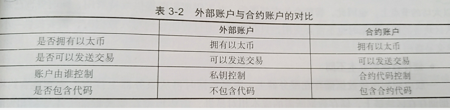

# 第3章 以太坊介绍
##### 3.1 了解以太坊
1. 以太坊希望成为像TCP/IP协议这样的标准，能让以太坊区块链协议内置编程语言，兼容各种区块链应用。
2. 根据以太坊白皮书的定义：以太坊是一个全新开放的区块链平台，它允许任何人在平台中建立和使用通过区块链技术运行的去中心化应用。
3. 以太坊的优点
- 账户：以太坊没有使用比特币UTXO模式，采用的是Account模式，优点有：
  - 节省空间，每笔交易只有一个输入、一个输出、一个签名
  - 可替代性更高
  - 编码简单，不需要更为复杂脚本
  - 轻客户端
4. 以太坊的缺点
- 目前以太坊区块链不适合快速、大量交易，或是需要存储较大数据的情况。
- 智能合约一经部署就永远存在，且不可更改，除非拥有者调用智能合约中的自毁（selfdestruct）功能。
- 以太坊节点上并不适合储存较大的文件。

##### 3.2 以太坊发展路线
1. 以太坊发展的四个阶段：
- Frontier(前沿)
- Homestead(家园)
- Metropolis(大都会)
  - Byzantium(拜占庭)
  - Constantinople(君士坦丁堡)
- Serenity(宁静)
在前三阶段以太坊共识算法采用工作量证明机制（POW），在第四阶段会切换到权益证明机制（POS），阶段之间的转换需要通过硬分叉的方式实现。

##### 3.3 以太坊内置货币
（1）以太币总量=ICO众筹期间发行的以太币 + 区块奖励 + 叔块奖励 + 书块引用奖励
- ICO众筹期间发行的以太币
  7200万以太币 每年产量被限制在7200的25%
- 区块奖励      5个以太币
- 叔块奖励      4.375个以太币
- 叔块引用奖励   0.15个以太币

##### 3.4 以太坊交易吞吐量
    交易吞吐量 = 交易数量/每秒 = （gasLimit/gas）/出块速度
（1）以太坊出块平均速度为15s，交易吞吐量每秒21笔交易
    交易吞吐量 = 区块包含交易数量/出块时间
- 区块链吞吐量与区块大小和出块时间有关
 
##### 3.5 以太坊账户
- 以太坊账户使用的是Account模型，以太坊中有两类账户：外部账户（EOA）和合约账户。
- 外部账户由私钥控制，每个账户都有自己的余额。拥有者可以通过创建和签名一笔交易从自己的外部账户发送信息。如果账户余额足够支付交易费用，则交易有效。外部账户的地址由公钥决定。
- 合约账户由代码控制。在一些情况下，当合约账户收到一条信息，合约内部的代码就会被激活，允许它对内部存储进行读取和写入、发送其它消息或者创建合约。合约账户的地址是在创建合约时确定的，合约账户地址由合约创建者的地址和该地址发出过的交易数量计算得到，地址发出过的交易数量也被称作nonce。

###### 账户内部结构
- 账户由四个部分组成，不管账户类型是什么，都存在这四个组成部分：
① nonce。如果账户是一个外部账户，nonce代表从该账户地址发送的交易数量，该数量会出现在交易的字段中，起到防止双花的目的。如果账户是一个合约地址，nonce代表该账户创建过的合约数量。
② balance。该账户拥有的余额，以wei为单位。
③ storageRoot.该账户的存储内容的Merkle Patricia树的根节点哈希值。Merkle树会将此账户存储内容的哈希值进行编码，默认是空值。
④ codeHash。如果是外部账户，codeHash是一个空字符串的Hash值，如果是合约账户，codeHash使该账户的EVM code的哈希值。和账户的其他字段不同，codeHash是不可变的，可以用来从状态数据库中获得相应的EVM code。

##### 3.6 智能合约
运行在区块链网络上的程序，称为智能合约，智能合约与合约执行的结果都会存储在区块链上边。在区块链背景下，智能合约不只是一个计算机程序：它自己就是一个参与者，对接收到的信息进行回应，同时可以接受和储存价值，也可以向外发送信息和价值。这个程序就像一个可以被信任的人，可以临时保存资产，总是按照事先的规则执行操作。
- 区块链与一般程序的差异性：
  - 整合金流难易程度
  - 部署及后续费用
  - 储存数据的成本不同
  - 部署后无法更改

##### 3.7 Gas与GasPrice
gasprice是你愿意为单位gas支付的费用，以gwei为单位。1 gwei = 1 000 000 000Wei，在交易中gasPrice是由发起交易的人规定的。
gaslimit代表了这个交易在执行过程中最多被允许消耗的gas数量。
             付款金额= Gas数量 * GasPrice
##### 3.8 工作量证明算法
以太坊使用的工作量证明算法叫Ethash。Ethash工作量证明是内存难解的，它的特点是挖矿的效率基本与CPU无关，却与内存大小和内存带宽正相关。对内存大小和带宽的要求意味着那些通过共享内存的方式大规模部署的矿机芯片并不能在挖矿效率上有线性或者超线性的增长。
- Ethash算法的设计目标：
  - 抵抗矿机
  - 轻客户端可验证
- Ethash算法的基本流程：
  - 存在一个种子, 可以通过块高度直到该点来计算每个块。
  - 从种子, 你可以计算一个 16 MB 的伪随机缓存, 用于轻客户端存储缓存。
  - 从缓存中, 我们可以生成一个 1 GB 的数据集, 该属性表示数据集中的每个项只依赖于缓存中的少量项。完整的客户和矿工存储这个数据集。数据集会随时间线性增长。
  - 挖矿涉及抓取数据集的随机切片并将它们一起哈希。可以通过使用缓存来重新生成所需的数据集的特定部分, 从而低内存的机器可以进行验证, 因为只需存储缓存即可验证。
  - 完整的大数据集每隔30000块更新一次, 因此大多数矿工的工作将是读取数据集, 而不是对其进行更改。

##### 3.9 以太坊网络类型
以太坊网络分为主网络和测试网络。主网络的networkid为1.
- 以太坊的测试网络：
  - Morden（已退役）2015.7-2016.11     难度炸弹严重影响出块速度
    共识机制：POW，networkid为2.
  - Ropsten（仍运行）                  为解决难度炸弹严重影响出块速度问题
    共识机制：POW，networkid为3.

  - Kovan（仍运行）                    仅有Parity钱包客户端可以使用这个测试网络。
    共识机制：权威证明（PoA），networkid为3.

   - Rinkeby（仍运行)
    共识机制：POW，networkid为4.

##### 3.10以太坊客户端
以太坊客户端用于接入以太坊网络，进行账户管理、交易、挖矿、智能合约相关的操作，也可作为一个HTTP-RPC服务器对外提供JSON-RPC接口。
- go-ethereum
(1)Geth客户端：它会连接到其他客户端网络下载同步区块，保持副本最新。它还可以挖矿和验证区块交易。它还可以充当服务器，用户可以通过RPC来访问暴露的API接口。
(2)Geth终端：这是一个命令行工具，可以让你连接到正在运行的节点并执行各种操作，如创建和管理账户，查询区块链，签署并将交易提交给区块链。